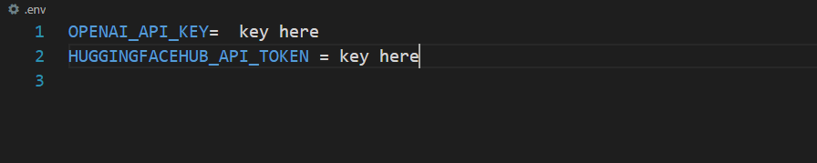

# PDF_Reader_ChatBot

PDF_Reader_ChatBot allows the user upload his any pdf document and then allow the user to ask questions about the document.

## Setup
  ```code
  conda create -n <env_name>
  conda activate <env_name>
  git clone https://github.com/USTAADCOM/PDF_Reader_ChatBot.git
  PDF_Reader_ChatBot
  pip install -r requirements.txt -q
  ```
## Project Structure
```bash
AWS_Lambda_API
   │   .gitignore
   │   app.py
   │   htmlTemplates.py
   │   README.md
   │   requirements.txt
```
## Run Streamlit Demo
```code
python3 app.py
```
## Note
-----
To use the PDF_Reader_ChatBot tool:
1. Ensure that you have installed the required dependencies and added the OpenAI API or  Hugging face hub key key to the `.env` file.
2. UnComment the openapi library in requirements.txt and also uncomment the code for
openapi functionality. 
